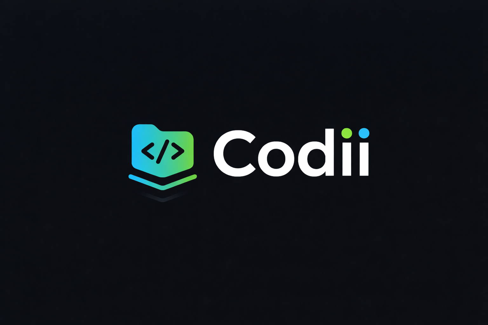
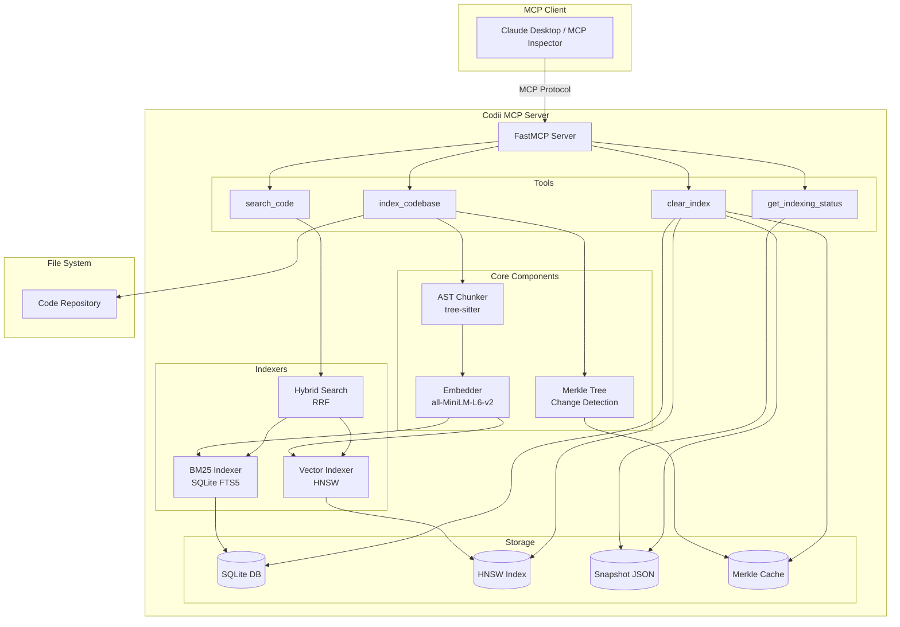
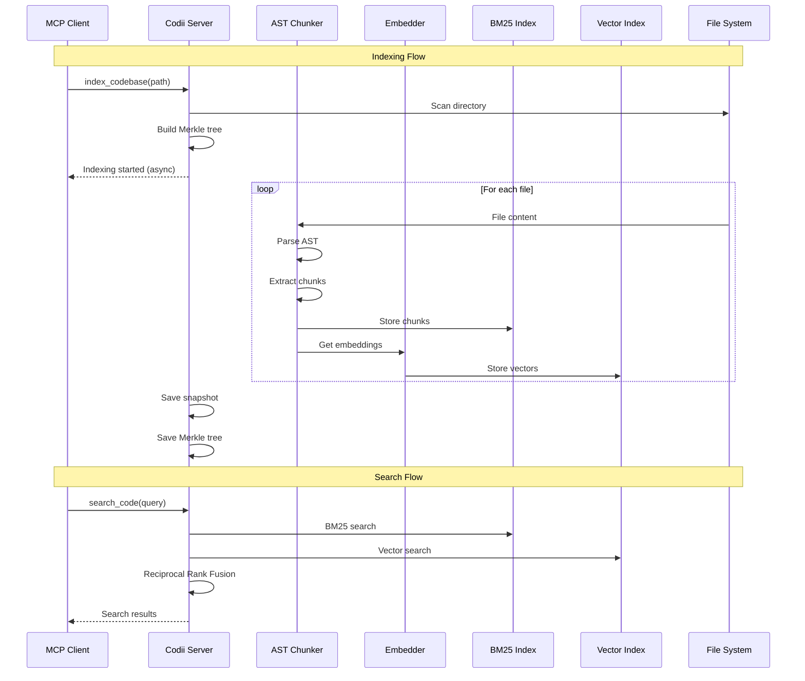

<p align="center">
  
</p>

# Codii - Local Code Repository Indexing MCP Server

A local code repository indexing MCP (Model Context Protocol) server with hybrid BM25 and vector search capabilities.

## Architecture Overview



## Data Flow



## Features

- **Hybrid Search**: Combines BM25 (SQLite FTS5) and vector search (HNSW) for optimal code retrieval
- **Smart Query Processing**: Multi-word queries are optimized with OR-matching, wildcards, code tokenization, and abbreviation expansion for better recall
- **AST-Aware Chunking**: Uses tree-sitter for semantic code splitting (functions, classes, etc.)
- **Incremental Updates**: Merkle tree-based change detection for efficient re-indexing
- **Local Embeddings**: CPU-runnable all-MiniLM-L6-v2 model for vector embeddings
- **Multi-Language Support**: Python, JavaScript, TypeScript, Go, Rust, Java, C/C++
- **Gitignore Support**: Automatically respects `.gitignore` patterns when indexing

## Prerequisites

This package depends on `hnswlib` which requires C++ compilation. You need Python development headers installed:

**Ubuntu/Debian:**
```bash
sudo apt install python3-dev build-essential
```

**Fedora/RHEL:**
```bash
sudo dnf install python3-devel gcc-c++
```

**macOS:**
```bash
xcode-select --install
```

**Alpine Linux:**
```bash
apk add python3-dev gcc g++ musl-dev
```

## Installation

### Option 1: pipx or uv tool (Recommended)

Both pipx and uv tool provide isolated environments for CLI tools. Use whichever you prefer.

**Using pipx:**

```bash
# Install directly from GitHub
pipx install git+https://github.com/oOSomnus/Codii.git

# Or install from local clone
git clone https://github.com/oOSomnus/Codii.git
cd codii
pipx install .
```

**Using uv tool:**

```bash
# Install directly from GitHub
uv tool install git+https://github.com/oOSomnus/Codii.git

# Or install from local clone
git clone https://github.com/oOSomnus/Codii.git
cd codii
uv tool install .
```

### Option 2: pip with venv

For users who prefer manual environment management.

```bash
git clone https://github.com/oOSomnus/Codii.git
cd codii
python -m venv .venv
source .venv/bin/activate  # On Windows: .venv\Scripts\activate
pip install -e .
```

### Option 3: uv pip (Development)

For development or users who already use uv and want an editable install.

```bash
git clone https://github.com/oOSomnus/Codii.git
cd codii
uv pip install -e .
```

## Uninstallation

```bash
# If installed with pipx
pipx uninstall codii

# If installed with uv tool
uv tool uninstall codii

# If installed with pip/uv pip
pip uninstall codii

# Remove Claude Code integration
claude mcp remove codii

# Optional: Remove all index data
rm -rf ~/.codii/
```

## Usage

### Running the MCP Server

After installation, simply run:

```bash
codii
```

If running from the source directory without installing:

```bash
# Using uv
uv run python -m codii.server

# Using standard Python
python -m codii.server
```

### MCP Tools

#### `index_codebase`

Index a codebase for semantic search.

```python
{
    "path": "/path/to/repo",        # Required: Absolute path
    "force": false,                  # Optional: Force re-index
    "splitter": "ast",               # Optional: "ast" or "langchain"
    "customExtensions": [".md"],     # Optional: Additional extensions
    "ignorePatterns": ["tests/"]     # Optional: Additional ignore patterns
}
```

#### `search_code`

Search indexed code.

```python
{
    "path": "/path/to/repo",    # Required: Absolute path
    "query": "function to sort", # Required: Search query
    "limit": 10,                 # Optional: Max results (default 10, max 50)
    "extensionFilter": [".py"]   # Optional: Filter by extension
}
```

#### `get_indexing_status`

Check indexing progress.

```python
{
    "path": "/path/to/repo"  # Required: Absolute path
}
```

#### `clear_index`

Clear an indexed codebase.

```python
{
    "path": "/path/to/repo"  # Required: Absolute path
}
```

## MCP Client Integration

### Claude Code

After installing the package (via pipx or pip), add it to Claude Code:

```bash
# Simple method - works after pipx install or pip install
claude mcp add --transport stdio codii -- codii
```

For manual configuration, edit `~/.claude/settings.json`:

```json
{
  "mcpServers": {
    "codii": {
      "command": "codii"
    }
  }
}
```

**Development Setup** (running from source without installing):

```bash
# Add using uv to run from source directory
claude mcp add --transport stdio codii -- uv run --directory /path/to/codii python -m codii.server
```

Or manually:

```json
{
  "mcpServers": {
    "codii": {
      "command": "uv",
      "args": ["run", "--directory", "/path/to/codii", "python", "-m", "codii.server"]
    }
  }
}
```

### Custom Storage Location

To use a custom storage location, set the `CODII_BASE_DIR` environment variable:

```json
{
  "mcpServers": {
    "codii": {
      "command": "codii",
      "env": {
        "CODII_BASE_DIR": "/custom/storage/path"
      }
    }
  }
}
```

### First Run Note

On first run, the embedding model (`all-MiniLM-L6-v2`) will be downloaded, which may take a few minutes.

## Storage

All index data is stored in `~/.codii/`:

```
~/.codii/
├── indexes/                    # SQLite databases per codebase
│   └── <hash-of-path>/
│       ├── chunks.db           # SQLite with FTS5
│       └── vectors.bin         # HNSW index
├── snapshots/
│   └── snapshot.json           # Index state tracking
└── merkle/
    └── <hash-of-path>.json     # Merkle tree cache per codebase
```

## Configuration

Create a `.codii.yaml` file in your project root:

```yaml
# Custom ignore patterns
ignore_patterns:
  - "dist/"
  - "*.generated.*"

# Custom file extensions
extensions:
  - ".kt"
  - ".scala"

# Embedding settings
embedding_model: "all-MiniLM-L6-v2"
embedding_batch_size: 32

# Chunk settings
max_chunk_size: 1500
min_chunk_size: 100
```

## Environment Variables

- `CODII_BASE_DIR`: Override the default storage directory

## Supported Languages

| Language | AST Chunking |
|----------|-------------|
| Python   | ✅          |
| JavaScript | ✅        |
| TypeScript | ✅        |
| Go       | ✅          |
| Rust     | ✅          |
| Java     | ✅          |
| C        | ✅          |
| C++      | ✅          |
| Others   | Text-based fallback |

## Project Structure

```
codii/
├── src/codii/
│   ├── server.py              # MCP server entry point
│   ├── tools/                 # MCP tool implementations
│   │   ├── index_codebase.py
│   │   ├── search_code.py
│   │   ├── clear_index.py
│   │   └── status.py
│   ├── indexers/              # Search indexers
│   │   ├── bm25_indexer.py    # SQLite FTS5
│   │   ├── vector_indexer.py  # HNSW
│   │   ├── hybrid_search.py   # RRF combination
│   │   └── query_processor.py # Query preprocessing
│   ├── chunkers/              # Code chunking
│   │   ├── ast_chunker.py     # tree-sitter based
│   │   └── text_chunker.py    # Fallback
│   ├── embedding/             # Embedding utilities
│   │   └── embedder.py
│   ├── merkle/                # Change detection
│   │   └── tree.py
│   ├── storage/               # Persistence
│   │   ├── database.py
│   │   └── snapshot.py
│   └── utils/                 # Utilities
│       ├── config.py
│       └── file_utils.py
└── pyproject.toml
```

## Development

```bash
# Install dev dependencies (using uv)
uv pip install -e ".[dev]"

# Or using pip
pip install -e ".[dev]"

# Run tests
pytest
```

## License

MIT