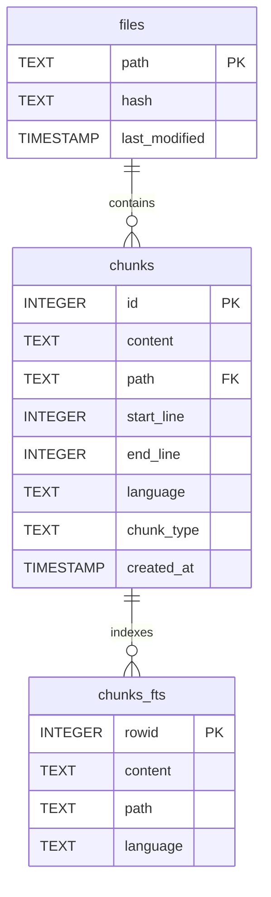

# Codii Schemas Reference

This document describes all data schemas used in Codii, including database tables, dataclasses, and file formats.

## Table of Contents

- [SQLite Database Schema](#sqlite-database-schema)
  - [chunks Table](#chunks-table)
  - [chunks_fts Virtual Table](#chunks_fts-virtual-table)
  - [files Table](#files-table)
  - [FTS Sync Triggers](#fts-sync-triggers)
- [Dataclasses](#dataclasses)
  - [SearchResult](#searchresult)
  - [CodebaseStatus](#codebasestatus)
  - [CodiiConfig](#codiconfig)
  - [ProcessedQuery](#processedquery)
- [File Formats](#file-formats)
  - [Snapshot JSON](#snapshot-json)

---

## SQLite Database Schema

Location: `~/.codii/indexes/<path-hash>/chunks.db`

The database uses SQLite with FTS5 for full-text search capabilities.

### Entity Relationship Diagram



**Relationships:**
- `chunks_fts` is an FTS5 virtual table that indexes `chunks` content via `rowid` → `chunks.id`
- Multiple `chunks` can belong to one `file` (one-to-many via `path`)
- Triggers (`chunks_ai`, `chunks_ad`, `chunks_au`) keep `chunks_fts` synchronized with `chunks`

### chunks Table

Stores code chunks with metadata for retrieval.

```sql
CREATE TABLE chunks (
    id INTEGER PRIMARY KEY AUTOINCREMENT,
    content TEXT NOT NULL,           -- The code chunk content
    path TEXT NOT NULL,              -- File path relative to codebase root
    start_line INTEGER,              -- Starting line number (1-based)
    end_line INTEGER,                -- Ending line number (1-based, inclusive)
    language TEXT,                   -- Programming language (e.g., "python", "javascript")
    chunk_type TEXT,                 -- Type of chunk (e.g., "function", "class", "method")
    created_at TIMESTAMP DEFAULT CURRENT_TIMESTAMP
);
```

**Indexes:**
- `idx_chunks_path` - Index on `path` column for faster file-based lookups

**Chunk Types:**
| Type | Description |
|------|-------------|
| `function` | Standalone functions |
| `class` | Class definitions |
| `method` | Methods within classes |
| `module` | Module-level code |
| `comment` | Documentation comments |
| `text` | Text chunk (fallback for non-code files) |

### chunks_fts Virtual Table

FTS5 virtual table for BM25 full-text search on chunk content.

```sql
CREATE VIRTUAL TABLE chunks_fts USING fts5(
    content,                         -- Chunk content (indexed)
    path,                            -- File path (indexed)
    language,                        -- Language (indexed)
    content='chunks',                -- Source table reference
    content_rowid='id'               -- Maps to chunks.id
);
```

**Query Preprocessing:**
The FTS5 queries are preprocessed for better recall:
- Multi-word queries use OR matching: `"page table walk"` → `page* OR table* OR walk*`
- Wildcard suffixes enable partial matching: `"kalloc"` → `kalloc*`

### files Table

Tracks file hashes for incremental indexing via Merkle tree comparison.

```sql
CREATE TABLE files (
    path TEXT PRIMARY KEY,           -- File path relative to codebase root
    hash TEXT NOT NULL,              -- SHA-256 hash of file content
    last_modified TIMESTAMP DEFAULT CURRENT_TIMESTAMP
);
```

### FTS Sync Triggers

Three triggers keep the FTS index synchronized with the main `chunks` table:

```sql
-- Insert trigger: adds new chunks to FTS
CREATE TRIGGER chunks_ai AFTER INSERT ON chunks BEGIN
    INSERT INTO chunks_fts(rowid, content, path, language)
    VALUES (new.id, new.content, new.path, new.language);
END;

-- Delete trigger: removes chunks from FTS
CREATE TRIGGER chunks_ad AFTER DELETE ON chunks BEGIN
    INSERT INTO chunks_fts(chunks_fts, rowid, content, path, language)
    VALUES('delete', old.id, old.content, old.path, old.language);
END;

-- Update trigger: updates FTS entries
CREATE TRIGGER chunks_au AFTER UPDATE ON chunks BEGIN
    INSERT INTO chunks_fts(chunks_fts, rowid, content, path, language)
    VALUES('Delete', old.id, old.content, old.path, old.language);
    INSERT INTO chunks_fts(rowid, content, path, language)
    VALUES (new.id, new.content, new.path, new.language);
END;
```

---

## Dataclasses

### SearchResult

Represents a single search result with combined BM25 and vector scores.

**Location:** `src/codii/indexers/hybrid_search.py`

```python
@dataclass
class SearchResult:
    id: int                    # Chunk ID in database
    content: str               # Code chunk content
    path: str                  # File path
    start_line: int            # Starting line number
    end_line: int              # Ending line number
    language: str              # Programming language
    chunk_type: str            # Type of chunk
    bm25_score: float = 0.0    # BM25 contribution to RRF score
    vector_score: float = 0.0  # Vector similarity contribution to RRF score
    combined_score: float = 0.0 # Final RRF score
    rank: int = 0              # Result rank (1-based)
```

**Scoring (Reciprocal Rank Fusion):**
```
combined_score = (bm25_weight / (k + bm25_rank)) + (vector_weight / (k + vector_rank))
```
Where `k = 60` (RRF constant), default weights are 0.5 each.

### CodebaseStatus

Tracks indexing status and progress for a codebase.

**Location:** `src/codii/storage/snapshot.py`

```python
@dataclass
class CodebaseStatus:
    path: str                           # Absolute path to codebase
    status: str                         # "indexed", "indexing", "failed", "not_found"
    progress: int = 0                   # Progress percentage (0-100)
    current_stage: str = ""             # "preparing", "chunking", "embedding", "indexing"
    merkle_root: Optional[str] = None   # SHA-256 hash of Merkle tree root
    indexed_files: int = 0              # Number of indexed files
    total_chunks: int = 0               # Total chunks created
    last_updated: Optional[str] = None  # ISO 8601 timestamp
    error_message: Optional[str] = None # Error message if status == "failed"
```

**Status Values:**
| Status | Description |
|--------|-------------|
| `indexed` | Codebase fully indexed and ready for search |
| `indexing` | Currently being indexed (check `progress` and `current_stage`) |
| `failed` | Indexing failed (check `error_message`) |
| `not_found` | Codebase not yet indexed |

**Stage Values:**
| Stage | Description |
|-------|-------------|
| `preparing` | Scanning files, building Merkle tree |
| `chunking` | Parsing files, creating chunks |
| `embedding` | Generating vector embeddings |
| `indexing` | Storing in database and vector index |
| `complete` | Indexing finished successfully |

### CodiiConfig

Application configuration with sensible defaults.

**Location:** `src/codii/utils/config.py`

```python
@dataclass
class CodiiConfig:
    # Storage paths
    base_dir: Path = ~/.codii

    # Embedding settings
    embedding_model: str = "all-MiniLM-L6-v2"
    embedding_batch_size: int = 32

    # HNSW vector index settings
    hnsw_m: int = 16                  # Number of connections per node
    hnsw_ef_construction: int = 200   # EF during index construction
    hnsw_ef_search: int = 100         # EF during search (higher = better recall)

    # Chunk settings
    max_chunk_size: int = 1500        # Maximum characters per chunk
    min_chunk_size: int = 100         # Minimum characters per chunk
    chunk_overlap: int = 200          # Character overlap between chunks

    # Search settings
    default_search_limit: int = 10
    max_search_limit: int = 50
    bm25_weight: float = 0.5          # Weight for BM25 in hybrid search
    vector_weight: float = 0.5        # Weight for vector search in hybrid search

    # Default ignore patterns (extends this list)
    default_ignore_patterns: List[str] = [
        ".git/", "__pycache__/", "node_modules/", ".venv/", "venv/", ".env/",
        "*.pyc", "*.pyo", "*.so", "*.dll", "*.dylib", "*.exe", "*.bin",
        "*.jpg", "*.jpeg", "*.png", "*.gif", "*.svg", "*.ico", "*.pdf",
        "*.zip", "*.tar", "*.gz", "*.rar", "*.7z",
        ".DS_Store", "Thumbs.db", "*.log", "*.tmp",
        ".idea/", ".vscode/", "*.swp", "*.swo",
        "dist/", "build/", "target/",
        ".tox/", ".pytest_cache/", ".mypy_cache/", ".ruff_cache/",
        "coverage/", "*.egg-info/",
    ]

    # Default file extensions to index
    default_extensions: List[str] = [
        ".py", ".js", ".jsx", ".ts", ".tsx",
        ".go", ".rs", ".java", ".c", ".cpp", ".cc", ".cxx",
        ".h", ".hpp", ".hxx",
        ".json", ".yaml", ".yml", ".toml",
        ".md", ".rst", ".txt",
        ".sh", ".bash", ".zsh",
        ".sql", ".proto",
        ".html", ".css", ".scss", ".less",
    ]
```

**Configuration Sources (in priority order):**
1. `CODII_BASE_DIR` environment variable
2. `.codii.yaml` in project root
3. Default values

**Derived Paths:**
```python
indexes_dir    = base_dir / "indexes"    # SQLite DBs and vector indices
snapshots_dir  = base_dir / "snapshots"  # Status tracking
merkle_dir     = base_dir / "merkle"     # Merkle tree cache
snapshot_file  = snapshots_dir / "snapshot.json"
```

### ProcessedQuery

Represents a preprocessed search query with expansions.

**Location:** `src/codii/indexers/query_processor.py`

```python
@dataclass
class ProcessedQuery:
    original: str              # Original user query
    terms: List[str]           # Cleaned, lowercased terms
    expanded_terms: List[str]  # Terms + code tokenization + abbreviation expansions
    fts_query: str             # Final FTS5 query string
```

**Example Processing:**
```python
# Input: "kalloc memory"
ProcessQuery(
    original="kalloc memory",
    terms=["kalloc", "memory"],
    expanded_terms=[
        "kalloc", "memory",
        "kernel_allocate", "kernel_allocation",  # abbreviation expansion
        "mem"  # from "memory"
    ],
    fts_query="kalloc* OR memory* OR kernel_allocate* OR kernel_allocation* OR mem*"
)
```

**Abbreviation Expansions:**
Common code abbreviations are automatically expanded for better recall. See `QueryProcessor.ABBREVIATIONS` in `query_processor.py` for the full list (50+ abbreviations).

---

## File Formats

### Snapshot JSON

**Location:** `~/.codii/snapshots/snapshot.json`

Tracks indexing status for all known codebases.

```json
{
  "codebases": {
    "/path/to/codebase": {
      "path": "/path/to/codebase",
      "status": "indexed",
      "progress": 100,
      "current_stage": "complete",
      "merkle_root": "abc123def456...",
      "indexed_files": 42,
      "total_chunks": 128,
      "last_updated": "2024-01-15T10:30:00.123456",
      "error_message": null
    },
    "/another/codebase": {
      "path": "/another/codebase",
      "status": "indexing",
      "progress": 45,
      "current_stage": "embedding",
      "merkle_root": null,
      "indexed_files": 20,
      "total_chunks": 60,
      "last_updated": "2024-01-15T11:00:00.654321",
      "error_message": null
    }
  }
}
```

**Path Hashing:**
Codebase paths are hashed (SHA-256, truncated to 16 hex chars) for index directory names:
```python
def path_to_hash(path: str) -> str:
    return hashlib.sha256(path.encode()).hexdigest()[:16]
```

Example: `/home/user/projects/myapp` → `a1b2c3d4e5f6a7b8`

---

## Directory Structure

```
~/.codii/
├── indexes/
│   └── <path-hash>/           # One per codebase
│       ├── chunks.db          # SQLite database
│       └── vectors.hnsw       # HNSW vector index
├── snapshots/
│   └── snapshot.json          # Global status file
└── merkle/
    └── <path-hash>.json       # Merkle tree cache per codebase
```